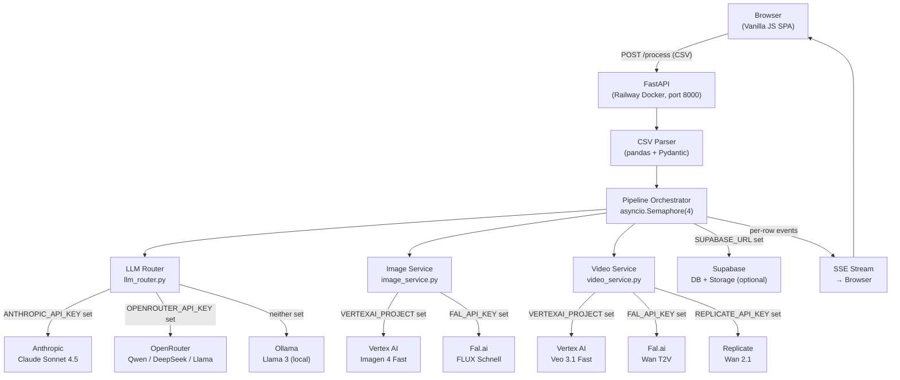
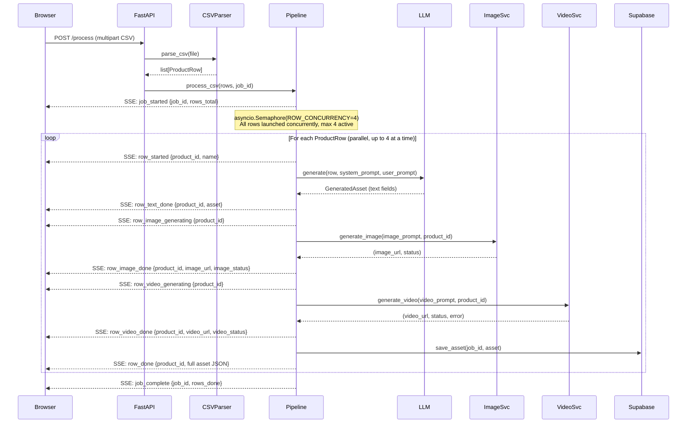
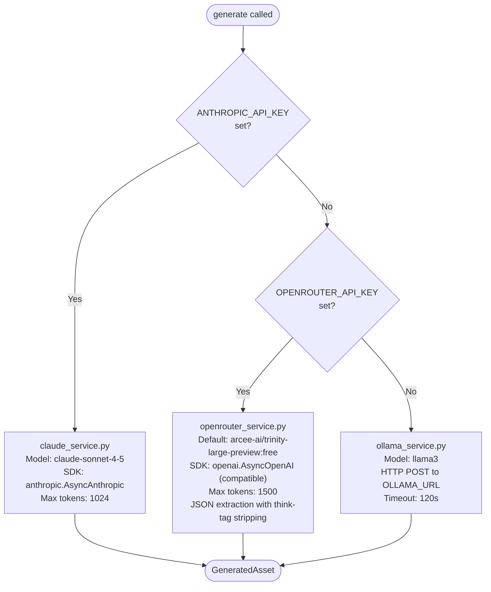
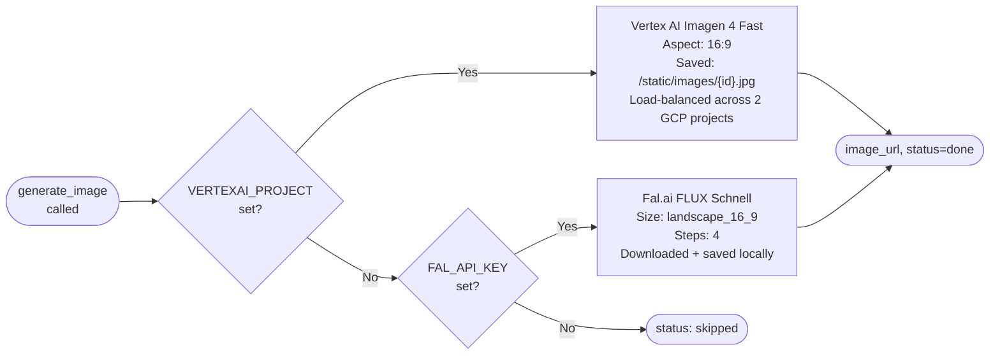
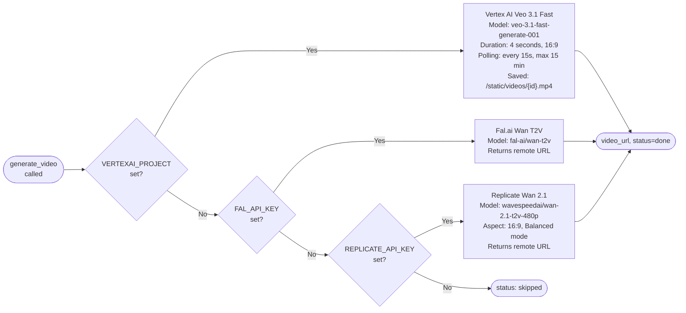
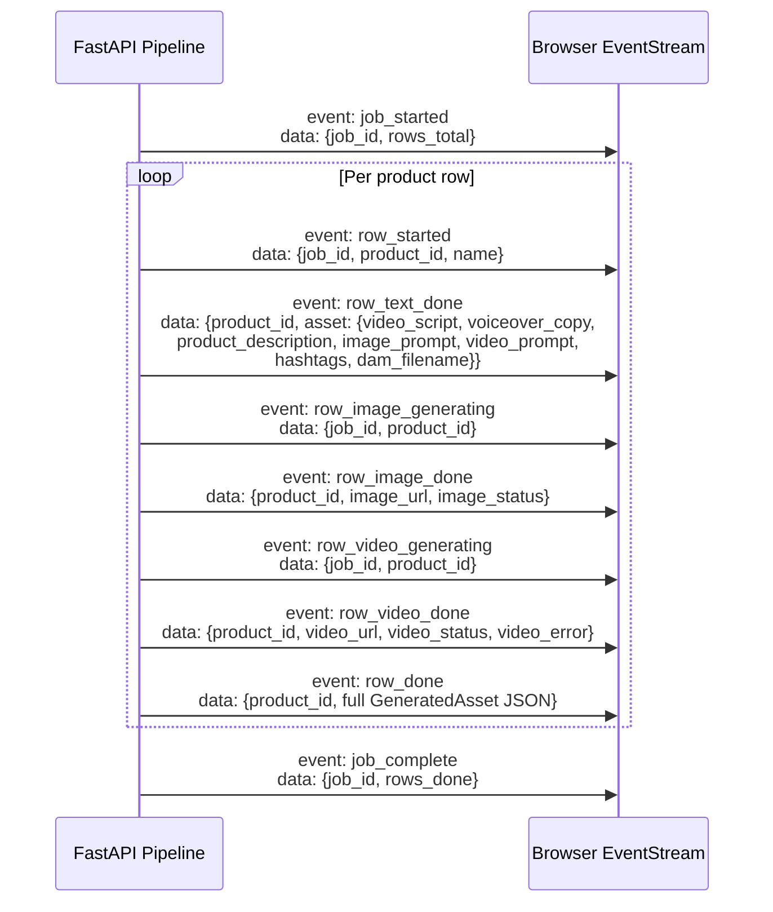
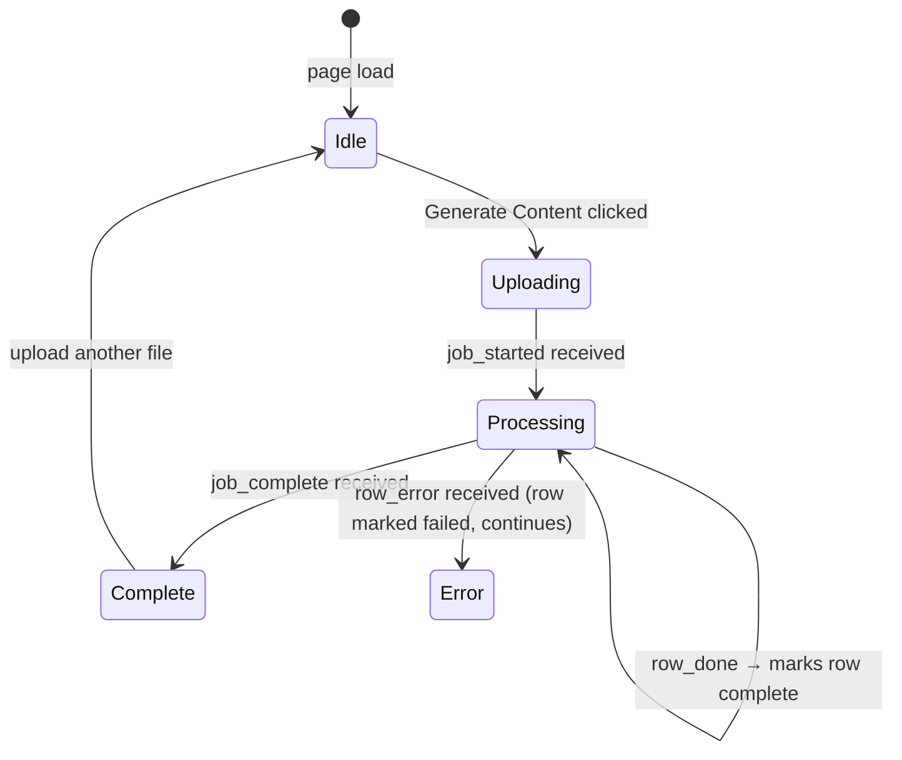

# Smartbox Content Engine — Technical Architecture

> Full system design for the Head of Content Automation.

---

## Architecture Philosophy

The system is built on four principles:

1. **Async-first** — every I/O operation (LLM calls, image generation, video polling, DB writes) is non-blocking. The FastAPI server can handle many concurrent requests without threads.
2. **Provider-agnostic** — no service is hardwired. Text, image, and video providers are resolved at runtime from environment variables. Swap providers by changing a single env var.
3. **Progressive enhancement** — the core pipeline (CSV → text assets) works with zero API keys via local Ollama. Each additional key unlocks a new capability tier.
4. **Zero frontend build step** — the UI is served as plain HTML/CSS/JS static files by FastAPI. No npm, no bundler, no Node.js runtime required.

---

## High-Level System Diagram



---

## Backend Architecture

### Directory Structure

```
backend/app/
├── main.py              # FastAPI app bootstrap, CORS, static file serving
├── config.py            # All env vars (pydantic-settings BaseSettings)
├── api/
│   ├── routes.py        # Main endpoints: /process (SSE), /health, /history, /assets
│   └── generate.py      # Standalone step endpoints: /generate/text, /image, /video
├── core/
│   ├── pipeline.py      # Orchestrates text → image → video per row, with SSE events
│   ├── csv_parser.py    # Validates and parses uploaded CSV into ProductRow list
│   └── dam_naming.py    # Generates DAM-compliant filenames
├── services/
│   ├── llm_router.py    # Picks Claude / OpenRouter / Ollama based on env vars
│   ├── claude_service.py
│   ├── openrouter_service.py
│   ├── ollama_service.py
│   ├── image_service.py
│   ├── video_service.py
│   └── supabase_service.py
├── models/
│   ├── product.py       # ProductRow schema + Category enum
│   ├── output.py        # GeneratedAsset schema (all output fields)
│   └── job.py           # PipelineJob schema + JobStatus enum
├── prompts/
│   ├── system_prompt.py # SYSTEM_PROMPT: brand voice, JSON schema, field specs
│   ├── content_prompt.py # build_prompt(row, tone) → per-row user message
│   ├── category_tones.py # CATEGORY_TONES dict (5 categories)
│   └── video_template.py # SMARTBOX_VIDEO_TEMPLATE + build_video_prompt()
└── utils/
    ├── logger.py        # structlog setup, get_logger()
    ├── sse.py           # format_sse(event, data) → SSE string
    └── exceptions.py    # CSVValidationError, LLMError, PipelineError
```

### Layer Responsibilities

| Layer | Responsibility | Key rule |
|-------|---------------|----------|
| `api/` | HTTP I/O only — parse requests, return responses | No business logic here |
| `core/` | Pure business logic — pipeline, parsing, naming | No HTTP, no external API calls |
| `services/` | External API calls only — LLM, image, video, DB | One external system per file |
| `models/` | Pydantic schemas — validation only | No logic, `strict=True` on all |
| `prompts/` | Prompt strings and brand tone config | No Python logic, just strings |
| `utils/` | Shared helpers — logger, SSE formatter, exceptions | Imported by any layer |

### Provider Routing Matrix

| Config property | Env var | Value when true |
|-----------------|---------|-----------------|
| `use_claude` | `ANTHROPIC_API_KEY` | Text via Anthropic SDK |
| `use_openrouter` | `OPENROUTER_API_KEY` | Text via OpenRouter free models |
| `use_vertexai` | `VERTEXAI_PROJECT` | Image + Video via Vertex AI |
| `use_fal` | `FAL_API_KEY` | Image + Video via Fal.ai |
| `use_replicate` | `REPLICATE_API_KEY` | Video via Replicate |
| `use_supabase` | `SUPABASE_URL` + `SUPABASE_SERVICE_KEY` | Persist to Supabase |

---

## Pipeline Flow



---

## LLM Routing



All three services expose the same interface:
```python
async def generate(row: ProductRow, system_prompt: str, user_prompt: str) -> GeneratedAsset
```

---

## Media Generation Cascade

### Image Generation



### Video Generation



> **Design decision:** No fallback cascade for media generation. If the primary provider fails, the step is marked `failed` rather than silently charging a second provider. This prevents unexpected cost escalation.

---

## Load Balancing

Two GCP projects can be configured to distribute Vertex AI calls and double the available quota.

**Configuration:**
```
VERTEXAI_PROJECT=gcp-project-1
VERTEXAI_LOCATION=us-central1
GOOGLE_APPLICATION_CREDENTIALS_JSON={...service account JSON...}

VERTEXAI_PROJECT_2=gcp-project-2
VERTEXAI_LOCATION_2=us-central1
GOOGLE_APPLICATION_CREDENTIALS_JSON_2={...service account JSON...}
```

**Runtime behaviour (`config.py`):**
```python
@property
def vertex_projects(self) -> list[dict]:
    # Returns list of {project, location, credentials} dicts
    # Both image_service and video_service call:
    cfg = random.choice(settings.vertex_projects)
    # → random distribution across all configured projects
```

Each image and video generation call independently picks a project at random. With two projects, load is distributed approximately 50/50 across the quota pools.

---

## API Architecture

### Core Endpoints

| Method | Path | Auth | Input | Output | Purpose |
|--------|------|------|-------|--------|---------|
| `GET` | `/health` | None | — | `{"status":"ok"}` | Health check for Railway/Docker |
| `GET` | `/config` | None | — | `{supabase_url, supabase_anon_key}` | Frontend auth bootstrap |
| `POST` | `/process` | Optional user header | `multipart/form-data` CSV + `X-User-ID` header | `text/event-stream` SSE | **Main pipeline endpoint** |
| `GET` | `/history` | `?user_id=X` | Query param | `[GeneratedAsset]` JSON | Load previous generations |
| `DELETE` | `/assets/{product_id}` | `?user_id=X` | Path + query param | `{"ok":true}` | Remove asset from DB + storage |
| `GET` | `/status/{job_id}` | None | Path param | `PipelineJob` JSON | In-memory job status |

### Standalone Generation Endpoints

| Method | Path | Input | Output |
|--------|------|-------|--------|
| `POST` | `/generate/text` | CSV file | `[GeneratedAsset]` (text fields only) |
| `POST` | `/generate/image` | `{product_id, image_prompt}` JSON | `{product_id, image_url, image_status}` |
| `POST` | `/generate/video` | `{product_id, video_prompt}` JSON | `{product_id, video_url, video_status, video_error}` |

---

## SSE Event Flow



**Error handling:** If any row's text step fails, a `row_error` event is emitted and the pipeline moves to the next row. The job continues regardless of individual row failures.

**Implementation:** Uses `asyncio.Queue` — workers push events into the queue as they complete, a consumer generator yields them as SSE strings. This decouples the concurrent workers from the serial HTTP response stream.

---

## Frontend Architecture

### Module Map

```
frontend/src/
├── index.html        # Shell — meta, font imports, layout HTML structure
├── js/
│   ├── app.js        # Entry point — initialises all modules, wires all events
│   │                 # Table state: search, sort, pagination (5/page)
│   │                 # CSV export, delete, auth flow, page loader with brand quotes
│   ├── api.js        # fetch wrapper + manual SSE parser (ReadableStream)
│   │                 # postCSV(file, {onEvent, onComplete, onError})
│   ├── ui.js         # All DOM rendering — card lifecycle, lightboxes, progress bar
│   │                 # renderCard, updateCardText, updateCardImage, updateCardVideo
│   ├── uploader.js   # Drag-drop + file input handler, .csv MIME validation
│   └── auth.js       # Supabase auth (Google SSO + email), lazy SDK load, no-op if unconfigured
└── css/
    ├── main.css       # Design tokens (CSS custom properties), base reset, layout
    └── components.css # Cards, buttons, pills, progress, upload zone, lightboxes
```

### SSE → UI State Transitions



### Why No Build Step?

- FastAPI mounts `frontend/src/` as `StaticFiles` — files are served directly
- ES modules (`type="module"`) handle imports natively in all modern browsers
- No transpilation needed — the target audience uses up-to-date browsers
- Docker image stays small (no node_modules) and builds in seconds
- Any frontend change takes effect on the next page refresh — no rebuild wait

---

## Brand Guidelines Implementation

### System Prompt Architecture (`prompts/system_prompt.py`)

The `SYSTEM_PROMPT` is the primary brand enforcement mechanism. It encodes:

```
Brand identity
  └─ "The gift of living, not owning" — Butterfly Effect of gifting
  └─ "Choose Wisely" platform — one experience can change everything

Brand voice rules
  └─ Warm, human, second-person ("you"), evocative, concise, aspirational
  └─ PROHIBITED: embark, journey, unforgettable, indulge, luxurious,
                 amazing, incredible, perfect gift, treat yourself, unique experience

Output schema (strict JSON)
  └─ video_script: 30-sec, 75 words, mid-experience, candid, vivid detail
  └─ voiceover_copy: 40–60 words, for the ear, warm friend tone
  └─ product_description: 2–3 sentences, evergreen, feeling-focused
  └─ image_prompt: 60–80 words, photorealistic NOT illustrated, camera spec
  └─ video_prompt: 15–25 words, scene inside the box, NO camera instructions
  └─ hashtags: 5–8 lowercase, no # symbol
```

### Per-Category Tone (`prompts/category_tones.py`)

```python
CATEGORY_TONES = {
    "getaways":    "Escapist, quietly romantic, fresh sheets, open windows...",
    "wellness":    "Calm, restorative, gently humorous, earned bliss...",
    "adventure":   "Energetic, daring, irreverently fun, gritty and joyful...",
    "gastronomy":  "Sensory, warm, ritual and anticipation, sophisticated...",
    "pampering":   "Curious, infectious, nervousness before + glow after...",
}
```

Each row's tone guidance is injected into `build_prompt()` alongside the product data.

### Branded Video Template (`prompts/video_template.py`)

```python
SMARTBOX_VIDEO_TEMPLATE = (
    "Drone approaching Smartbox box in {environment_hint}. "
    "Box features Smartbox branding. Lid opens with soft magical glow. "
    "Inside: {scene}. "
    "Premium travel-commercial cinematic style, smooth camera motion, "
    "natural lighting, joyful authentic emotions, 4 seconds total."
)
```

The LLM generates the `scene` (15–25 words describing what's inside the box). The template wraps it with the Smartbox brand signature moment. This ensures every video starts with a consistent branded unboxing before the experience-specific content.

### CSS Design Token System (`frontend/src/css/main.css`)

All hex values are defined **once** as CSS custom properties. No hex values appear anywhere else in the codebase.

```css
:root {
  /* Brand colours */
  --color-coral:        #E8593C;  /* Primary CTA, icons, progress bar */
  --color-coral-hover:  #D14A2E;  /* Hover state */
  --color-coral-tint:   #FFF0EC;  /* Subtle backgrounds, drag-drop zone */
  --color-navy:         #1A1A2E;  /* Hero section, dark panels */
  --color-dark-surface: #2D2D44;  /* Card backgrounds on dark */
  --color-warm-white:   #F9F6F2;  /* Page background */
  --color-text-primary: #1A1A2E;  /* Body text */
  --color-text-muted:   #6B6B80;  /* Secondary text, DAM filename */
}
```

### DAM Filename Convention (`core/dam_naming.py`)

```
PROD-{product_id}_{CATEGORY}_{LOCALE}_{YYYYMMDD}.mp4

Examples:
  PROD-1002_GETAWAYS_IE_20260317.mp4
  PROD-5501_WELLNESS_GB_20260317.mp4
  PROD-3310_ADVENTURE_FR_20260317.mp4
```

- `product_id` — from CSV `id` column
- `CATEGORY` — uppercased category enum value
- `LOCALE` — from `DEFAULT_LOCALE` env var (default: `IE`)
- `YYYYMMDD` — generation date (UTC)
- Generated exclusively by `core/dam_naming.py` — never constructed elsewhere

---

## Production Readiness Checklist

| Concern | Implementation |
|---------|---------------|
| **Security** | Non-root Docker user (`appuser`); all secrets via env vars; no hardcoded credentials |
| **Health monitoring** | `GET /health` returns `{"status":"ok"}`; Docker `HEALTHCHECK` polls it every 30s |
| **Observability** | structlog structured logging on every service call, pipeline event, and error |
| **Input validation** | Pydantic v2 `strict=True` on all models; `CSVValidationError` with line numbers |
| **Error isolation** | Per-row errors emit `row_error` and continue — one bad row never kills the job |
| **Async safety** | All external calls use `asyncio.to_thread()` for sync SDKs; no `time.sleep()` |
| **Exception hierarchy** | `CSVValidationError`, `LLMError`, `PipelineError` — all extend `SmartboxBaseError` |
| **Container size** | `python:3.12-slim` base; no Node.js, no devtools in image |
| **Port flexibility** | `${PORT:-8000}` — respects Railway's injected `$PORT` env var |
| **Test coverage** | 27/27 tests passing across CSV parsing, DAM naming, pipeline, and all API routes |

---

## Scalability Considerations

### Current State (POC)

| Component | Current | Production Path |
|-----------|---------|----------------|
| Job store | In-memory Python dict | Redis (persistent, shared across instances) |
| Media storage | Local `/app/static/` | Supabase Storage (already wired, opt-in) |
| Row concurrency | `asyncio.Semaphore(4)` per process | Increase `ROW_CONCURRENCY` env var; or horizontal scaling |
| Auth | Optional Supabase | Already enterprise-ready when configured |

### Horizontal Scaling

The container is fully **stateless** for media generation when Supabase is configured:
- Generated images/videos are uploaded to Supabase Storage and served via CDN URL
- Multiple Railway instances can run in parallel
- Each instance independently processes its own SSE connections
- The only shared state is the Supabase DB (handled by Supabase's connection pooler)

### Tuning Parallelism

```bash
# Process 8 rows at once instead of 4
ROW_CONCURRENCY=8

# Reduce to 1 for strict quota management
ROW_CONCURRENCY=1
```

No code changes required — the semaphore reads this at startup.

### Quota Scaling via Multi-Project Load Balancing

Each Vertex AI project has its own QPM (queries per minute) quota. By configuring two projects, the effective quota doubles:

```
Single project:  N requests/min for Imagen + Veo
Two projects:   ~2N requests/min (random distribution)
```

Additional projects can be added by extending the `vertex_projects` property in `config.py`.

---

## Full Data Model

### `GeneratedAsset` (all fields)

| Field | Type | Description |
|-------|------|-------------|
| `product_id` | `str` | From CSV `id` column |
| `video_script` | `str` | 30-sec script (~75 words), mid-experience moment |
| `voiceover_copy` | `str` | 40–60 words, written for the ear |
| `product_description` | `str` | 2–3 sentences, evergreen, feeling-focused |
| `image_prompt` | `str` | 60–80 word photography/AI image brief |
| `video_prompt` | `str` | 15–25 word scene inside the box |
| `hashtags` | `list[str]` | 5–8 lowercase hashtags, no `#` |
| `dam_filename` | `str` | `PROD-{id}_{CATEGORY}_{LOCALE}_{YYYYMMDD}.mp4` |
| `image_url` | `str` | `/static/images/{id}.jpg` or Supabase CDN URL |
| `video_url` | `str` | `/static/videos/{id}.mp4` or remote provider URL |
| `image_status` | `str` | `"skipped"` \| `"generating"` \| `"done"` \| `"failed"` |
| `video_status` | `str` | `"skipped"` \| `"generating"` \| `"done"` \| `"failed"` |
| `image_error` | `str` | Error message if `image_status == "failed"` |
| `video_error` | `str` | Error message if `video_status == "failed"` |

### `ProductRow` (CSV input)

| Field | Type | Validation |
|-------|------|------------|
| `id` | `str` | Required |
| `name` | `str` | Required |
| `location` | `str` | Required |
| `price` | `float` | Required, parsed from string |
| `category` | `Category` | Enum: `getaways`, `wellness`, `adventure`, `gastronomy`, `pampering` |
| `key_selling_point` | `str` | Required |

---

## Environment Variables Reference

### Text LLM (pick at least one, or use Ollama locally)

| Variable | Default | Description |
|----------|---------|-------------|
| `ANTHROPIC_API_KEY` | — | Anthropic API key → Claude Sonnet 4.5 |
| `LLM_MODEL` | `claude-sonnet-4-5` | Override Claude model ID |
| `OPENROUTER_API_KEY` | — | OpenRouter key → free models |
| `OPENROUTER_MODEL` | `arcee-ai/trinity-large-preview:free` | Override OpenRouter model |
| `OLLAMA_URL` | `http://localhost:11434` | Ollama base URL for local fallback |

### Vertex AI (primary media provider)

| Variable | Description |
|----------|-------------|
| `VERTEXAI_PROJECT` | GCP project ID (required for Vertex AI) |
| `VERTEXAI_LOCATION` | Region (default: `us-central1`) |
| `GOOGLE_APPLICATION_CREDENTIALS` | Path to service account JSON (local dev) |
| `GOOGLE_APPLICATION_CREDENTIALS_JSON` | Full JSON string (Railway / containers) |
| `VERTEXAI_PROJECT_2` | Second GCP project for load balancing (optional) |
| `VERTEXAI_LOCATION_2` | Region for second project |
| `GOOGLE_APPLICATION_CREDENTIALS_JSON_2` | Credentials for second project |

### Media fallbacks

| Variable | Description |
|----------|-------------|
| `FAL_API_KEY` | Fal.ai key — FLUX image + Wan video fallback |
| `REPLICATE_API_KEY` | Replicate key — Wan video second fallback |

### Persistence & Auth

| Variable | Description |
|----------|-------------|
| `SUPABASE_URL` | Supabase project URL |
| `SUPABASE_SERVICE_KEY` | Service key (server-side DB operations) |
| `SUPABASE_ANON_KEY` | Anon key (returned to frontend for browser auth) |

### App Settings

| Variable | Default | Description |
|----------|---------|-------------|
| `DEFAULT_LOCALE` | `IE` | Locale code in DAM filenames |
| `ROW_CONCURRENCY` | `4` | Max rows processed in parallel |
